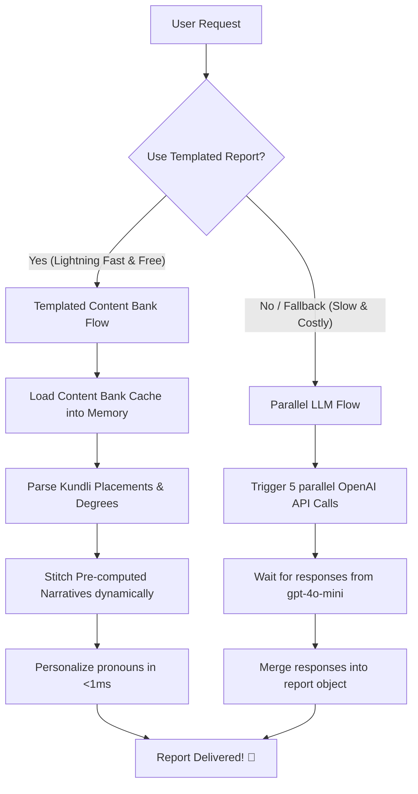

# 🚀 Graho's AI Free Report System: The Ultimate Team Guide!

Hey team! 👋 This document is your one-stop guide to how our **AI Free Report** system works under the hood. 

We wanted a system that is lightning-fast, highly reliable, and doesn't cost us a fortune in OpenAI API bills. So, we designed a smart hybrid setup that blends pre-generated templates with real-time stitching. 

Let’s dive into how it works, the math behind the combinations, our design decisions, and how to migrate the data!

---

## 📖 How It Works: The High-Level Architecture

When a request for a free report comes in, the backend checks if we want to run the fast cached flow (controlled by `process.env.USE_TEMPLATED_FREE_REPORT === "true"` or parameter flags like `context.useTemplated` / `userRequest.useTemplated`).

Here is a visual of the two paths:



### Path 1: The New Templated Content Bank Flow (⚡ ~5-50ms)
* **Main File:** [templatedFreeReportService.js](file:///c:/Users/dines/OneDrive/Desktop/Graho/backend-server/services/templatedFreeReportService.js)
* **What's the idea?** We pre-generate high-quality paragraphs for every possible planet-sign-house, nakshatra, and dosha combination using the LLM once. We store them in a database table called `content_bank` represented by the [contentBank.js](file:///c:/Users/dines/OneDrive/Desktop/Graho/backend-server/model/horoscope/contentBank.js) model.
* **How it executes:** During runtime, the server fetches these text fragments from our memory cache in `<1ms`, glues them together with natural transition words, runs a quick regex replacement to swap third-person pronouns ("the native") with second-person ("you"), and serves the finished report.
* **Cost:** **$0.00** at runtime!
* **Internet Dependency:** **Zero** (runs completely offline from local DB cache).

### Path 2: The Parallel LLM Flow (🐢 30+ seconds fallback)
* **Main File:** [freeReportAiService.js](file:///c:/Users/dines/OneDrive/Desktop/Graho/backend-server/services/freeReportAiService.js)
* **What's the idea?** It fires 5 parallel OpenAI chat completions API calls simultaneously (general details, vimshottari dasha, rudraksha suggestions, gemstone suggestions, and dosha reports).
* **Why it's a fallback:** It takes 30+ seconds to complete, costs money for every single report, and can hit rate limits or timeout errors if OpenAI has a bad day.

---

## 🧮 How the Combinations are Made

To make sure the report reads like it was written on the spot by a personal astrologer, we decoupled the chart factors and pre-computed the combinations. 

Here is the exact math behind the **2,928 total combinations** handled by [generateContentBank.js](file:///c:/Users/dines/OneDrive/Desktop/Graho/backend-server/scripts/generateContentBank.js):

| Category | Combos Formula | Total Keys | Key Format Example | Prompt Focus & Vibe |
| :--- | :--- | :---: | :--- | :--- |
| **Planet Placements** | 9 Planets × 12 Signs × 12 Houses | **1,296** | `planet:Mars:sign:Aries:house:4` | Trait description of how the planetary energy channels through a zodiac sign into a specific house. |
| **Ascendant (Lagna)** | 12 Signs × 3 Sections | **36** | `ascendant:description:Leo`<br>`ascendant:physical:Leo`<br>`ascendant:relationship:Leo` | Split into **general behavior**, **physical presence/aura**, and **relationship style** to keep things diverse and non-repetitive. |
| **Moon Placements** | 12 Signs × 3 Sections | **36** | `moon:description:Taurus`<br>`moon:personality:Taurus`<br>`moon:health:Taurus` | Split into **emotional baseline**, **cognitive style**, and **somatic health/stress tendencies**. |
| **Nakshatra-Pada** | 27 Nakshatras × 4 Padas | **108** | `nakshatra:Ashwini:pada:1` | Granular character traits and destiny direction based on exact lunar mansion degrees. |
| **Dasha Lord Predictions** | 9 Planets × 12 Signs × 12 Houses | **1,296** | `dasha:Saturn:sign:Virgo:house:10` | 3-stage chronological prediction of how a Mahadasha starts (early), peaks (middle), and transitions (late). |
| **Rudraksha Recommendations** | 9 Planets × 3 Severity Levels | **27** | `rudraksha:Sun:severity:high` | Astrological shielding recommendations and guidelines when a planet is functional-malefic or weak. |
| **Gemstones** | 12 Ascendants × 9 weak planets | **108** | `gemstone:ascendant:Aries:weakplanet:Mercury` | Recommendations tailored to the Lagnesh methodology (strengthening functional benefics, avoiding malefic gems). |
| **Manglik Dosha** | 3 Severity levels | **3** | `dosha:manglik:heavy` | Balanced analysis mapping `none`, `mild`, and `heavy` states without fear-mongering. |
| **Sade Sati** | 5 Progression Phases | **5** | `dosha:sadesati:peak` | Phase-specific guidelines for `free`, `rising`, `peak`, `setting`, and `post` phases. |
| **Kaal Sarp Dosha** | 13 Types | **13** | `dosha:kaalsarp:kulik` | Constructive analysis for `none` + 12 classical Kaal Sarp variations. |
| **Total** | | **2,928** | | |

---

## 🔮 The Astrological Logic Behind the Design

Every combination key and text structure is designed to reflect classical Vedic Astrology (Jyotish) principles while keeping it behavior-focused:

### 1. Planet + Sign + House Placement
* **Astrological Reason:** A planet is the **Actor** (what force is operating), the Zodiac Sign is the **Environment/Temperament** (how the planet behaves based on elements, modalities, and dignity), and the House is the **Department of Life** (where the energy manifests—e.g., 2nd house for family wealth, 10th house for public career).
* **Design Decision:** Combining these three (1,296 permutations per planet) allows the narrative to explain how a planet's energy behaves in a specific environment to affect a specific area of life, instead of rendering generic textbook descriptions.

### 2. Decoupling Ascendant (Lagna) & Moon Sign Placements
* **The Ascendant (Lagna):** Governs the physical body, outward vitality, and how one interfaces with the material world (the 1st house).
  * *Relationship Decoupling:* Because the Ascendant represents the self, it projects directly onto the 7th house (which governs partnerships). A Leo Ascendant interacts with relationships through an Aquarius (7th house) lens. Hence, Ascendant sign dictates relationship defaults.
* **The Moon Sign:** Governs the *Manas`* (mind, emotional baseline, and perceptions).
  * *Health Decoupling (Somatic Stress):* In Ayurvedic and Vedic sciences, emotional suppressions manifest directly as physical illnesses. The Moon governs bodily fluids and emotional resilience. The Moon sign dictates the target organ systems (e.g. stomach/digestion for Cancer/Moon, nervous system for Gemini/Mercury) that absorb mental stress.

### 3. Nakshatra-Pada (`nakshatra:${n}:pada:${p}`)
* **Astrological Reason:** The zodiac is divided into 27 Nakshatras (lunar mansions) representing deep subconscious instincts and karmic drives. Each Nakshatra is divided into 4 *Padas* (quarters) mapping to Navamsha (D9) signs, showing the underlying evolutionary soul direction.

### 4. Vimshottari Dasha Lord Predictions (`dasha:${p}:sign:${s}:house:${h}`)
* **Astrological Reason:** Vimshottari Dasha is a 120-year planetary timing cycle calculated from the Moon's exact nakshatra position at birth. A dasha lord activates the themes of the house it resides in, the sign it occupies, and the houses it rules.
* **Design Decision:**
  * *Chronological Arc:* The text splits the dasha into three phases (Initiation, Peak, and Transition) to reflect how planetary transit pressure shifts over a long dasha cycle.
  * *Rulership Calculation:* The stitching engine dynamically appends chart notes based on which houses the planet rules for that specific Ascendant (e.g., Saturn ruling the 9th and 10th houses for a Taurus Ascendant makes the dasha highly auspicious for career).

### 5. Gemstones: Lagnesh & Functional Benefics Methodology
* **Astrological Reason:** We recommend three stones: **Life Stone** (strengthens Lagnesh/1st lord for health and self-identity), **Lucky Stone** (strengthens 5th lord for intelligence, speculation, and kids), and **Fortune Stone** (strengthens 9th lord for dharma and luck).
* **Constraint:** The system strictly avoids recommending gemstones for planets ruling functional malefic houses (6th lord of debt/disease, 8th lord of obstacles, 12th lord of losses) to prevent amplifying life challenges.

### 6. Constructive Dosha Re-framing
* **Astrological Reason:** Heavy afflictions (Manglik Dosh, Sade Sati, Kaal Sarp Dosh) are historically framed using fatalistic, fear-inducing language. 
* **Design Choice:** The combinations map to constructive, behavioral guidance. Manglik is reframed as *high emotional drive* requiring action-oriented outlets; Sade Sati is reframed as *structural maturity* and *discipline* under Saturn's review; Kaal Sarp is explained as a *focused karmic axis* that yields high focus and determination once mastered.

---

## 🛠️ How Entries are Made (The Generation Pipeline)

The database content bank entries are built using a specialized seeding pipeline:

1. **Prompt Design:** The prompts in [generateContentBank.js](file:///c:/Users/dines/OneDrive/Desktop/Graho/backend-server/scripts/generateContentBank.js) constrain the LLM behavior:
   * Define the persona (Elite Vedic Astrologer).
   * Specify constraints: no markdown formatting, no introductory phrases, exact sentence and word bounds.
   * Mandate second-person perspective (`"you"`) or clean parameterized structures to ensure seamless integration.
2. **Combination Queueing:** The script iterates through the Cartesian products of planets, houses, signs, nakshatras, and severity levels.
3. **Database Write:**
   * It first queries `ContentBank.findByPk(key)` to verify if the combination exists.
   * If it exists and `--overwrite` flag is absent, it skips to preserve OpenAI credits.
   * Otherwise, it calls `gpt-4o-mini`, receives the raw text, and upserts it into the `content_bank` table using Sequelize:
     ```js
     await ContentBank.create({ key, category, text, version, tags });
     ```

---

## ⏱️ Time & Cost Estimates for Batch Seeding

If you need to generate/regenerate the content bank database using live OpenAI completions, here are the numbers:

### 1. Time Required
* The script [generateContentBank.js](file:///c:/Users/dines/OneDrive/Desktop/Graho/backend-server/scripts/generateContentBank.js) executes sequentially and incorporates a **200ms throttle** between API requests to prevent triggering rate limits.
* Average network latency + LLM generation time = **~800ms - 1000ms** per request.
* **Total Time Required:** 2,928 requests × 1 second = **~48.8 minutes** (approx. 50 minutes to complete a full run).

### 2. Cost Analysis (Using `gpt-4o-mini`)

Each completion is configured with `max_tokens: 300` and uses optimized prompts.

* **Input Tokens (Prompts):**
  * Avg. prompt length = ~120 tokens.
  * Total Input Tokens = 2,928 × 120 = ~351,360 tokens.
  * *Cost ($0.150 per 1M tokens)* = **$0.05**
* **Output Tokens (Generated Narratives):**
  * Avg. output length = ~200 tokens (150 words).
  * Total Output Tokens = 2,928 × 200 = ~585,600 tokens.
  * *Cost ($0.600 per 1M tokens)* = **$0.35**
* **Total Estimated Cost for Seeding:** **~$0.40 - $0.50 USD** (extremely cheap!).

> [!IMPORTANT]
> While generating the entire bank via `gpt-4o-mini` is under **$1.00 USD**, generating via the standard `gpt-4o` model will cost **~$8.40 USD** (due to $2.50/M input, $10.00/M output pricing). Avoid standard `gpt-4o` for mass batch operations unless necessary.

---

## 🔀 Stitching & Personalization Logic

When `generateTemplatedFreeReport()` is invoked:
1. **Connectors:** Connective transitions (e.g., *Additionally, However, Looking at your overall trajectory*) are chosen randomly using `getConnector(type)` to blend sentences naturally.
2. **Conflict Checks:** `areElementsConflicting()` analyzes the elements of the Ascendant and Moon signs (e.g. Fire vs. Water). If conflicting, a transition indicating internal psychological friction is inserted:
   > *"This creates a private, often fascinating tension within you — your Moon in Scorpio introduces a different emotional response."*
3. **Personalization Engine:** All content in the Content Bank is stored in a structured third-person perspective (or parameterized format). `personalizeInline()` runs regex routines to replace the following patterns:
   * `\bthe native\b` $\rightarrow$ `"you"`
   * `\bthis native\b` $\rightarrow$ `"you"`
   * `\bthe individual\b` $\rightarrow$ `"you"`
   * `\bsuch individuals\b` $\rightarrow$ `"people like you"`
   * `\bthose with this placement\b` $\rightarrow$ `"you"`
   * `\bindividuals with this placement\b` $\rightarrow$ `"you"`
   * `\bone with this placement\b` $\rightarrow$ `"you"`
   
   This runs in **<1ms** on the main CPU thread, ensuring perfect, direct-to-user engagement.

---

## 🚀 Migration Guide: Local to Production

When developing locally, you populate the table `content_bank` in your local Postgres database. When deploying the application to production (hosted on Supabase), you must transfer this populated data.

Here are the three methods for database migration:

### Method 1: Local Backup/Restore Utility (JSON-based - Recommended)
We have created two specialized scripts for backup and restore using the Sequelize models:
* [exportContentBank.js](file:///c:/Users/dines/OneDrive/Desktop/Graho/backend-server/scripts/exportContentBank.js)
* [importContentBank.js](file:///c:/Users/dines/OneDrive/Desktop/Graho/backend-server/scripts/importContentBank.js)

#### Steps:
1. **Export Local Data:**
   Run the export script on your local machine with local `.env` values pointing to your local DB:
   ```bash
   node scripts/exportContentBank.js
   ```
   *This creates a [content_bank_backup.json](file:///c:/Users/dines/OneDrive/Desktop/Graho/backend-server/content_bank_backup.json) file in the backend-server root.*

2. **Upload/Move JSON Backup:**
   Ensure the generated `content_bank_backup.json` is present in the server directory of your deployment setup.

3. **Import to Production DB:**
   Switch your `.env` variables to target the production Supabase database credentials (or run it on the production server):
   ```bash
   node scripts/importContentBank.js
   ```
   *This reads the JSON file and uses bulk upserts (`upsert()`) via Sequelize to write the data to the Supabase database. This guarantees safe, non-duplicate inserts.*

---

### Method 2: Native PostgreSQL Dump and Restore (SQL-based)
If you prefer standard PostgreSQL command-line tools:

#### Steps:
1. **Dump local table data:**
   Execute this in your terminal (substituting your local user and db credentials):
   ```bash
   pg_dump -h localhost -U postgres -d graho_local -t content_bank --data-only --inserts > content_bank_data.sql
   ```
   
2. **Restore to Supabase Production:**
   Run the SQL script directly against your production Supabase database:
   ```bash
   psql -h aws-0-ap-south-1.pooler.supabase.com -p 5432 -U postgres.your-project-ref -d postgres -f content_bank_data.sql
   ```
   *Alternatively, you can copy the contents of `content_bank_data.sql` and execute it inside the Supabase Console's SQL Editor.*

---

### Method 3: Direct Seeding to Production (Live Generation)
If you do not want to copy data and prefer to generate the data directly into production:

#### Steps:
1. Configure your local `.env` variables to connect directly to the production database host (`SUPABASE_DB_HOST`, etc.).
2. Execute the generator script:
   ```bash
   node scripts/generateContentBank.js --live
   ```
   *Note: This will take ~50 minutes and make 2,928 live API calls to OpenAI, costing about $0.50. Run with caution.*

> [!WARNING]
> Always verify that your target table structure in production matches the Sequelize model. Running `importContentBank.js` will automatically trigger `ContentBank.sync()` which creates the table if it does not exist, keeping your migrations safe.

---

## 📂 Files Directory & Script Roles Reference

Here is a quick-reference list of all files involved in the AI Free Report system, their specific responsibilities, and how to execute the associated scripts:

### 1. Core Logic & Routers

* #### ⚙️ [templatedFreeReportService.js](file:///c:/Users/dines/OneDrive/Desktop/Graho/backend-server/services/templatedFreeReportService.js)
  * **Role:** The primary driver of the Templated Flow. It loads the `content_bank` table from PostgreSQL into an in-memory cache at startup, evaluates Ascendant and Moon element conflicts, stitches paragraphs together using dynamic connectors, parses Dasha timelines, formats Rudraksha and Gemstone recommendations, and applies direct second-person personalization.
  * **Key Function:** `generateTemplatedFreeReport({ userRequest, kundli, context })`

* #### ⚙️ [freeReportAiService.js](file:///c:/Users/dines/OneDrive/Desktop/Graho/backend-server/services/freeReportAiService.js)
  * **Role:** The wrapper/routing layer that coordinates free report requests. It checks the configuration variables (e.g. `process.env.USE_TEMPLATED_FREE_REPORT`) and decides whether to route the request to the high-speed Templated Flow or fallback to the parallel LLM flow.
  * **Key Function:** `generateFreeReportNarratives(...)`

### 2. Database Models

* #### 🗄️ [contentBank.js](file:///c:/Users/dines/OneDrive/Desktop/Graho/backend-server/model/horoscope/contentBank.js)
  * **Role:** The Sequelize schema definition for the `content_bank` table.
  * **Attributes:**
    * `key` (TEXT, Primary Key): Unique lookup identifier (e.g. `planet:Sun:sign:Leo:house:1`).
    * `category` (TEXT): Category grouping (e.g., `planet`, `ascendant`, `moon`, `dasha`, `gemstone`, `rudraksha`, `dosha`).
    * `text` (TEXT): The generated premium narrative content.
    * `version` (INTEGER): Template versioning.
    * `tags` (JSON): Diagnostic information (e.g. generation dates, environment markers).

### 3. Executable Scripts & Seeding

* #### 🚀 [generateContentBank.js](file:///c:/Users/dines/OneDrive/Desktop/Graho/backend-server/scripts/generateContentBank.js)
  * **Role:** The seeder engine that generates all possible 2,928 text templates and populates the database. It can run in dry-run mode (local generation mock) or live mode (calling OpenAI).
  * **How to run:**
    * *Dry Run (Simulated text generation, safe, free, fast):*
      ```bash
      node scripts/generateContentBank.js
      ```
    * *Live Run (Generates real narratives from OpenAI and saves to DB):*
      ```bash
      node scripts/generateContentBank.js --live
      ```
    * *Filtered Category Run (Seeding a specific category only):*
      ```bash
      node scripts/generateContentBank.js --live --category dosha
      ```
    * *Limited Count Run (Test generating only N entries):*
      ```bash
      node scripts/generateContentBank.js --live --limit 10
      ```
    * *Overwrite existing entries:*
      ```bash
      node scripts/generateContentBank.js --live --overwrite
      ```

* #### 📤 [exportContentBank.js](file:///c:/Users/dines/OneDrive/Desktop/Graho/backend-server/scripts/exportContentBank.js)
  * **Role:** Connects to the database configured in your `.env` and exports the contents of the `content_bank` table into a local JSON backup file.
  * **How to run:**
    ```bash
    node scripts/exportContentBank.js
    ```
    *Output:* Generates `content_bank_backup.json` in your project root.

* #### 📥 [importContentBank.js](file:///c:/Users/dines/OneDrive/Desktop/Graho/backend-server/scripts/importContentBank.js)
  * **Role:** Reads `content_bank_backup.json` and performs safe bulk-upserts (inserting or updating existing keys) to the target database configured in `.env`.
  * **How to run:**
    ```bash
    node scripts/importContentBank.js
    ```
    *Note:* Ensure you switch your `.env` connection values to the target database (e.g., Supabase Production Host) before running.
